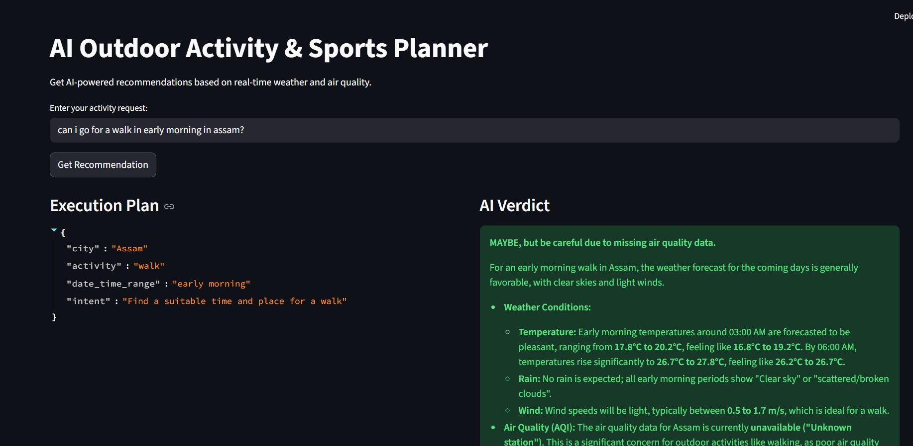
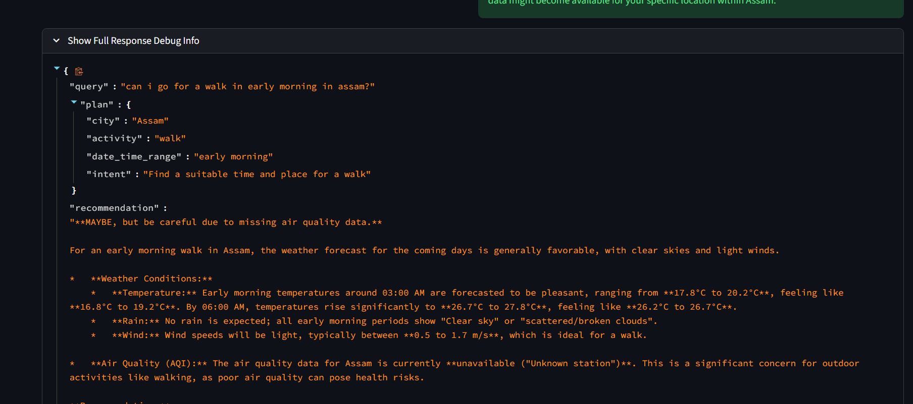
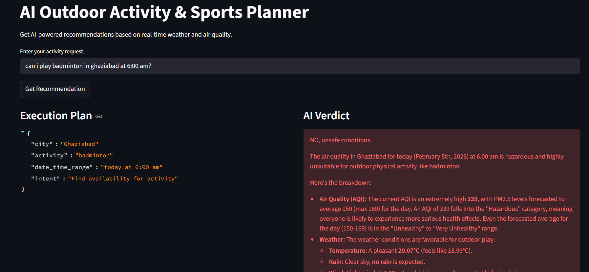
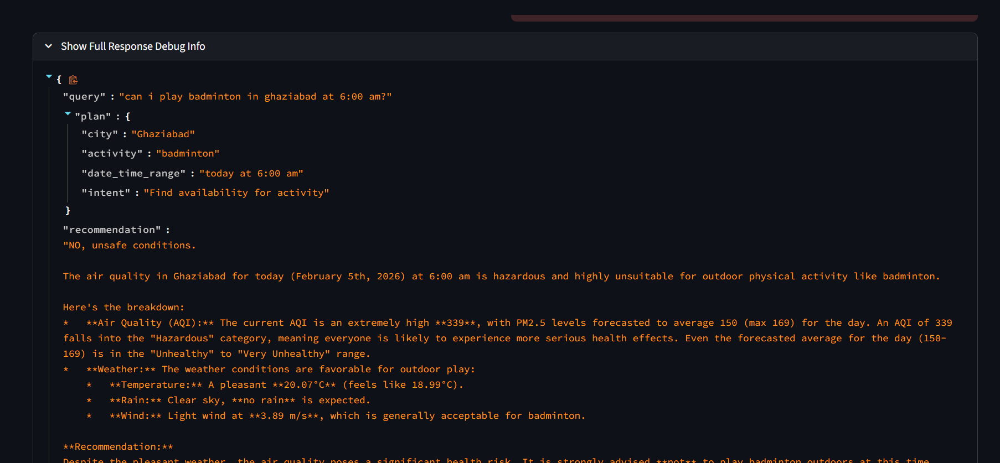

# AI Outdoor Activity & Sports Planner

A multi-agent AI system that recommends the best time and conditions for outdoor activities based on real weather and air quality data.

## Features
- **Multi-Agent Architecture**: Planner, Executor, and Verifier agents work together.
- **Real-time Data**: Integrates OpenWeatherMap and World Air Quality Index (WAQI) APIs.
- **LLM Powered**: Uses Google Gemini for intelligent planning and verification.
- **FastAPI**: High-performance web framework.
- **Streamlit UI**: User-friendly frontend for easy interaction.

## Architecture
1. **Planner Agent**: Parses user request into a structured plan (City, Activity, Timeframe).
2. **Executor Agent**: Fetches real-time weather and air quality data for the planned location.
3. **Verifier Agent**: Analyzes the data against safety rules and generates a final recommendation.

## Setup

### Prerequisites
- Python 3.8+
- API Keys for:
  - [Google Gemini](https://ai.google.dev/)
  - [OpenWeatherMap](https://openweathermap.org/api)
  - [WAQI (World Air Quality Index)](https://aqicn.org/api/)

### Installation

1. Create a virtual environment:
   ```bash
   python -m venv venv
   # Windows
   venv\Scripts\activate
   # Mac/Linux
   source venv/bin/activate
   ```

2. Install dependencies:
   ```bash
   pip install -r requirements.txt
   ```

3. Configure Environment Variables:
   - Copy `.env.example` to `.env`:
     ```bash
     cp .env.example .env
     ```
   - Open `.env` and fill in your API keys.

## Running the Application

### 1. Start the Backend API (FastAPI)
```bash
uvicorn main:app --reload
```
The API will run at `http://127.0.0.1:8000`.

### 2. Start the Frontend (Streamlit)
Open a new terminal, activate the venv, and run:
```bash
streamlit run frontend.py
```
The UI will open in your browser at `http://localhost:8501`.

## Usage

### Via Streamlit UI
- Open the web interface.
- Enter your query (e.g., "Can I play cricket in Bangalore today?").
- Click "Get Recommendation".

### Via API (Postman / cURL)
Send a POST request to `/query` with a JSON body:

```json
{
  "query": "Is it safe to go jogging in Mumbai tomorrow morning?"
}
```


### Example Prompts
1. "When is the best time to play football in Noida this week?"
2. "Is tomorrow morning good for jogging in Delhi?"
3. "Can I go cycling in Pune this weekend?"

## Screenshots

- Some of the screenshots showing the working of the application.





## APIs Used
- **Google Gemini**: Natural language understanding and reasoning.
- **OpenWeatherMap**: Current and forecast weather data.
- **WAQI**: Real-time air quality index.

## Structure
- `agents/`: Contains Planner, Executor, and Verifier logic.
- `tools/`: API wrappers for Weather and Air Quality.
- `utils/`: Helper functions (LLM client).
- `main.py`: FastAPI application entry point.
- `frontend.py`: Streamlit dashboard.
